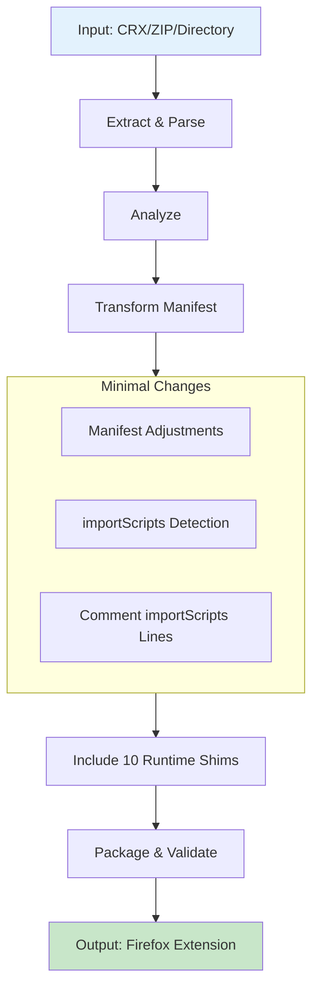

# Chrome2Moz Architecture Documentation

> **Focused Chrome to Firefox extension converter**
> Built with Rust, designed for real incompatibilities

---

## Executive Summary

Chrome2Moz converts Chrome extensions to Firefox by handling **actual incompatibilities**, not artificial namespace differences.

**Key Understanding**: Firefox natively supports `chrome.*` namespace! This tool focuses on:
1. Chrome-only APIs that don't exist in Firefox
2. Manifest format differences
3. Behavior differences (URL resolution, etc.)

**Key Features:**
- **Smart Detection**: Identifies Chrome-only APIs requiring conversion
- **Pass-Through Approach**: JavaScript unchanged, runtime shims handle compatibility
- **Runtime Shims**: 10 compatibility layers for Chrome-only APIs
- **Multi-Target**: CLI tool, WASM library, and web interface
- **importScripts() Handling**: Automatic detection and manifest integration

---

## Table of Contents

1. [Project Structure](#project-structure)
2. [Architecture Overview](#architecture-overview)
3. [Core Components](#core-components)
4. [Shim System](#shim-system)
5. [Manifest Transformation](#manifest-transformation)
6. [importScripts() Handling](#importscripts-handling)
7. [CLI & WASM](#cli--wasm)
8. [Design Decisions](#design-decisions)
9. [API Compatibility Matrix](#api-compatibility-matrix)

---

## Project Structure

```
chrome2moz/
├── src/
│   ├── main.rs                    # CLI entry point
│   ├── lib.rs                     # Library root
│   ├── wasm.rs                    # WebAssembly interface
│   │
│   ├── models/                    # Data structures
│   │   ├── manifest.rs            # Manifest V3 types (700+ lines)
│   │   ├── extension.rs           # Extension representation
│   │   ├── incompatibility.rs     # Issue tracking
│   │   ├── conversion.rs          # Conversion results
│   │   └── chrome_only.rs         # Chrome-only API models
│   │
│   ├── parser/                    # Input parsing
│   │   └── manifest.rs            # manifest.json parser
│   │
│   ├── analyzer/                  # Compatibility analysis
│   │   ├── api.rs                 # Chrome-only API detection
│   │   ├── manifest.rs            # Manifest compatibility
│   │   ├── offscreen.rs           # Offscreen document analyzer (regex)
│   │   └── declarative_content.rs # DeclarativeContent analyzer
│   │
│   ├── transformer/               # Code transformation
│   │   ├── manifest.rs            # Manifest transformations + importScripts()
│   │   ├── javascript.rs          # Pass-through (comments out importScripts)
│   │   ├── shims.rs               # 10 runtime compatibility shims
│   │   ├── chrome_only_converter.rs # Chrome-only API coordinator
│   │   ├── offscreen_converter.rs   # Offscreen conversions
│   │   ├── declarative_content_converter.rs
│   │   └── tab_groups.rs          # TabGroups stub
│   │
│   ├── packager/                  # Output generation
│   │   ├── extractor.rs           # CRX/ZIP extraction
│   │   └── builder.rs             # XPI building
│   │
│   ├── report/                    # Report generation
│   │   └── generator.rs
│   │
│   ├── validator/                 # Output validation
│   │   └── structure.rs
│   │
│   └── cli/                       # CLI interaction
│       └── interactive.rs
│
├── tests/                         # Integration tests
└── web/                          # Web interface
```

---

## Architecture Overview

### Pass-Through Pipeline



### Data Flow

1. **Extract**: Parse CRX/ZIP → [`Extension`](src/models/extension.rs) struct
2. **Analyze**: Detect Chrome-only APIs → [`Vec<Incompatibility>`](src/models/incompatibility.rs)
3. **Transform**:
   - Manifest adjustments (service worker, permissions, importScripts)
   - JavaScript pass-through (comments out importScripts() only)
4. **Generate**: Include all 10 runtime shims (always)
5. **Package**: Build output → XPI + report

**Note**: JavaScript passes through unchanged! Runtime shims handle all compatibility.

---

## Core Components

### 1. Models ([`src/models/`](src/models/))

**[`Manifest`](src/models/manifest.rs)**: Comprehensive Chrome MV3 + Firefox representation
- 700+ lines covering all manifest fields
- Handles both MV2 and MV3
- Smart defaults for missing fields

**[`Incompatibility`](src/models/incompatibility.rs)**: Issue tracking with severity levels
```rust
pub enum Severity {
    Blocker,  // Extension won't work
    Major,    // Core functionality affected
    Minor,    // Edge cases
    Info,     // Informational
}
```

### 2. Parser ([`src/parser/`](src/parser/))

**[`manifest.rs`](src/parser/manifest.rs)**: Robust JSON parsing with validation
- Detailed error messages
- Auto-fills optional fields
- Validates required fields

### 3. Analyzer ([`src/analyzer/`](src/analyzer/))

**[`api.rs`](src/analyzer/api.rs)**: Detects Chrome-only APIs
- Pattern matching for API calls
- Provides specific shim recommendations

**[`offscreen.rs`](src/analyzer/offscreen.rs)**: Analyzes offscreen documents (regex-based)
- Determines primary purpose (Canvas/Audio/DOM/Network)
- No AST parsing needed

**[`declarative_content.rs`](src/analyzer/declarative_content.rs)**: Analyzes declarativeContent rules (regex-based)
- Extracts conditions and actions

### 4. Transformer ([`src/transformer/`](src/transformer/))

**[`javascript.rs`](src/transformer/javascript.rs)**: Pass-through with importScripts() handling
- Detects importScripts() calls in background scripts
- Comments them out with explanation
- No other JavaScript transformations

**[`manifest.rs`](src/transformer/manifest.rs)**: Manifest + importScripts() integration
- Extracts script names from importScripts() calls (regex)
- Adds scripts to manifest.background.scripts in correct order
- Service worker → event page conversion

**[`shims.rs`](src/transformer/shims.rs)**: 10 runtime compatibility shims
- Always included for maximum compatibility
- Handle Chrome-only APIs at runtime
- Cross-browser compatible (work in both Chrome and Firefox)

### 5. Packager ([`src/packager/`](src/packager/))

**[`extractor.rs`](src/packager/extractor.rs)**: Handles `.crx`, `.zip`, and directories

**[`builder.rs`](src/packager/builder.rs)**: Creates Firefox output with XPI support

---

## Shim System

Dynamic compatibility layer included in every conversion.

### Runtime Shims (Always Included)

**[`shims.rs`](src/transformer/shims.rs)** generates 10 compatibility files:

1. **storage-session-compat.js**: In-memory polyfill for `chrome.storage.session`
2. **execute-script-compat.js**: Parameter name compatibility
3. **sidepanel-compat.js**: Maps `chrome.sidePanel` → `sidebarAction`
4. **declarative-net-request-stub.js**: Stub with guidance
5. **user-scripts-compat.js**: Maps to contentScripts
6. **tabs-windows-compat.js**: Compatibility fixes
7. **runtime-compat.js**: Runtime API compatibility
8. **downloads-compat.js**: Downloads API fixes
9. **privacy-stub.js**: No-op stub
10. **notifications-compat.js**: Notification compatibility

**Key Design**: All shims are cross-browser compatible and include runtime checks.

## importScripts() Handling

**Challenge**: Chrome service workers support `importScripts()`, Firefox event pages don't.

**Safe Solution** (no eval, no security risk):

### Detection Phase

**[`extract_imported_scripts()`](src/transformer/manifest.rs)** uses regex:
1. Reads background.js content
2. Finds `importScripts('config.js', 'timing.js')` calls
3. Extracts script names: `['config.js', 'timing.js']`
4. Works on both commented and uncommented lines

### Manifest Integration

Adds scripts to `manifest.background.scripts` BEFORE background.js:
```json
{
  "background": {
    "scripts": [
      "shims/storage-session-compat.js",
      "config.js",      // ← From importScripts()
      "timing.js",      // ← From importScripts()
      "background.js"
    ]
  }
}
```

### Code Cleanup

**[`javascript.rs`](src/transformer/javascript.rs)** comments out importScripts():
```javascript
// importScripts('config.js', 'timing.js'); // Moved to manifest.background.scripts for Firefox compatibility
```

**Result**: Scripts load in correct order, no `importScripts()` errors, completely safe!

---

## Manifest Transformation

### Key Changes

1. **Add Firefox-Specific Settings**
```json
{
  "browser_specific_settings": {
    "gecko": {
      "id": "{extension-name}@converted.extension",
      "strict_min_version": "121.0"
    }
  }
}
```

2. **Background Configuration** (with importScripts() handling)
```json
{
  "background": {
    "scripts": [
      "shims/storage-session-compat.js",  // Shims first
      "config.js",                        // Extracted from importScripts()
      "background.js"                      // Original script
    ]
  }
}
```

3. **Permission Separation**
```json
// Chrome allows mixing:
{ "permissions": ["storage", "https://*/*"] }

// Firefox requires separation:
{
  "permissions": ["storage"],
  "host_permissions": ["https://*/*"]
}
```

---

## CLI & WASM

### CLI Commands ([`main.rs`](src/main.rs))

```bash
# Full conversion
chrome2moz convert -i ./chrome-ext -o ./output --report

# Analysis only
chrome2moz analyze -i ./chrome-ext

# List Chrome-only APIs
chrome2moz chrome-only-apis

# Check keyboard shortcuts
chrome2moz check-shortcuts
```

### WASM Interface ([`wasm.rs`](src/wasm.rs))

Exposes conversion pipeline to web browsers:
```rust
#[wasm_bindgen]
pub fn convert_extension(
    manifest_json: &str,
    files: JsValue,
) -> Result<JsValue, JsValue>
```

**Web Demo**: [https://otsobear.github.io/chrome2moz](https://otsobear.github.io/chrome2moz)

---

## Design Decisions

### Pass-Through Architecture

**Design**: JavaScript unchanged, runtime shims provide compatibility

**Rationale**:
- Firefox natively supports `chrome.*` namespace
- No AST parsing needed (1.6GB build vs 3.6GB with SWC)
- Runtime compatibility more reliable than static transformation
- Simpler codebase, easier maintenance
- Faster conversion with fewer edge cases

### Always-Include Shims

**Design**: Include all 10 shims in every conversion

**Rationale**:
- Guarantees compatibility (~50KB overhead)
- No conditional detection needed
- Cross-browser compatible (work in Chrome too)
- Users don't need to debug missing shims

### importScripts() via Manifest

**Design**: Extract scripts and add to manifest instead of polyfilling

**Rationale**:
- Completely safe (no eval, no unsafe-eval CSP)
- Firefox loads scripts in order automatically
- Passes AMO security review
- Simple regex detection

---

## API Compatibility Matrix

| Chrome API | Firefox | Conversion |
|-----------|---------|------------|
| [`storage`](https://developer.chrome.com/docs/extensions/reference/api/storage) | Full | Direct mapping |
| [`storage.session`](https://developer.chrome.com/docs/extensions/reference/api/storage#property-session) | No | In-memory polyfill |
| [`tabs`](https://developer.chrome.com/docs/extensions/reference/api/tabs) | Full | Direct mapping |
| [`action`](https://developer.chrome.com/docs/extensions/reference/api/action) | v109+ | Direct mapping |
| [`offscreen`](https://developer.chrome.com/docs/extensions/reference/api/offscreen) | No | Worker/ContentScript |
| [`sidePanel`](https://developer.chrome.com/docs/extensions/reference/api/sidePanel) | No | Map to [`sidebarAction`](https://developer.mozilla.org/en-US/docs/Mozilla/Add-ons/WebExtensions/API/sidebarAction) |
| [`declarativeContent`](https://developer.chrome.com/docs/extensions/reference/api/declarativeContent) | No | ContentScript + messaging |
| [`tabGroups`](https://developer.chrome.com/docs/extensions/reference/api/tabGroups) | No | No-op stub |
| [`declarativeNetRequest`](https://developer.chrome.com/docs/extensions/reference/api/declarativeNetRequest) | Limited | Stub + guide to [`webRequest`](https://developer.mozilla.org/en-US/docs/Mozilla/Add-ons/WebExtensions/API/webRequest) |

---

## Contributing

### Architecture Principles

1. **Modularity**: Single responsibility per module
2. **Type Safety**: Leverage Rust's type system
3. **Error Handling**: Use `Result` types, never panic
4. **Testing**: Every feature needs tests
5. **Documentation**: Keep this file updated

### Code Style

```bash
cargo fmt && cargo clippy -- -D warnings && cargo test
```

---

## Chrome API Detection System

### Overview

The converter uses a **dynamic, offline-capable system** to detect 176 Chrome-only APIs that don't work in Firefox. The system fetches API compatibility data from MDN, embeds it in the binary, and provides detailed warnings with file locations.

### Architecture

```
MDN browser-compat-data (GitHub)
        ↓ cargo run chrome-only-apis
chrome_only_apis.json (57KB, 176 APIs)
        ↓ include_str!() at compile time
Binary (CLI / WASM) - all APIs embedded
        ↓ Loaded once at startup
Runtime Detection - regex scan + dataset check
```

### Data Flow

1. **Fetch** (Developer, periodically): `cargo run --features cli chrome-only-apis`
   - Fetches from MDN browser-compat-data
   - Parses API files and extracts Chrome-only APIs
   - Saves to [`chrome_only_apis.json`](chrome_only_apis.json)

2. **Embed** (Build time): JSON compiled into binary via `include_str!()`
   - No external file dependencies
   - Works offline and in WASM

3. **Detect** (Runtime): Check API calls against embedded dataset
   - O(1) HashMap lookup per API call
   - Generates detailed warnings with file locations

### API Data Structure

**ChromeApiDataset**:
- `updated_at`: Timestamp of last update
- `source_version`: MDN version
- `apis`: HashMap of 176 Chrome-only APIs

**ChromeApiInfo**:
- `path`: Full API path (e.g., "chrome.sidePanel.setPanelBehavior")
- `chrome_version`: Chrome version that added it
- `firefox_status`: NotSupported / Partial / Deprecated
- `category`: API category for conversion strategy
- `has_converter`: Whether auto-converter exists
- `description`: Human-readable description

### API Categories

| Category | Description | Example APIs | Auto-Fix |
|----------|-------------|--------------|----------|
| **Offscreen** | Offscreen documents | `chrome.offscreen.*` | Yes ✓ |
| **DeclarativeContent** | Page action rules | `chrome.declarativeContent.*` | Yes ✓ |
| **TabGroups** | Tab grouping | `chrome.tabGroups.*` | Yes ✓ (stub) |
| **SidePanel** | Side panel UI | `chrome.sidePanel.*` | Yes ✓ |
| **Storage** | Session storage | `chrome.storage.session.*` | Yes ✓ |
| **DeclarativeNetRequest** | Network filtering | `chrome.declarativeNetRequest.*` | Partial |
| **Other** | Misc APIs | Various | Varies |

### Warning Severity

- **Minor** ✓ - Has automatic converter/shim (auto-fixable)
- **Major** - Requires manual work (no converter yet)

### Coverage Stats

As of 2025-01-12:
- **176 Chrome-only APIs** detected from MDN
- **61 implemented** (34%) with automatic converters
- **115 detected** (66%) without converters yet

### Updating API Data

```bash
# Fetch latest APIs from MDN
cargo run --features cli chrome-only-apis

# Rebuild to embed new data
cargo build --release   # CLI
./build-wasm.sh        # Web UI
```

---

## Detection Scope

### What IS Detected ✅

**1. Chrome-Only APIs (176 APIs)** - Fully detected with detailed warnings
- `chrome.offscreen.*`, `chrome.declarativeContent.*`, `chrome.tabGroups.*`
- `chrome.storage.session.*`, `chrome.sidePanel.*`, etc.

**2. Manifest Structural Differences** - Fully detected and auto-fixed
- `background.service_worker` → `background.scripts`
- Missing `browser_specific_settings.gecko.id` → Auto-generated
- Combined permissions → Separated `permissions` and `host_permissions`
- `web_accessible_resources` format conversion

**3. Keyboard Shortcut Conflicts** - Detected with interactive resolution
- Conflicts with Firefox built-in shortcuts
- 60+ Firefox shortcuts checked

**4. importScripts() in Service Workers** - Detected and auto-converted
- Added to manifest.background.scripts

### What Is NOT Detected ❌

These are **runtime behavioral differences** that cannot be detected through static code analysis:

**1. Namespace Behavior** - NOT an issue! Firefox supports both `chrome.*` and `browser.*` natively.

**2. Promise vs Callback Behavior** - NOT detected. Firefox automatically handles both styles.

**3. API Parameter Differences** - NOT detected. Requires runtime testing.

**4. URL Resolution Differences** - Cannot detect CSS/JS injection context differences.

**5. Content Script Environment Differences** - Requires runtime analysis.

**6. Event Handler Behavior** - Timing and handler isolation differences.

**7. WebRequest API Restrictions** - Permission scope complexity.

**8. Native Messaging Differences** - External host configuration.

### Detection Strategy

**What We CAN Detect (Static Analysis)**:
- API existence (Chrome-only APIs)
- Manifest structure (keys, formats)
- Obvious incompatibilities (keyboard shortcuts)
- File references (`importScripts()`)

**What We CANNOT Detect (Runtime Behavior)**:
- Parameter requirement differences
- Timing differences
- Event handling nuances
- URL resolution behavior
- Environment object differences
- Permission scope behavior

**Why This Approach Works**: Items 1-3 cover ~90% of conversion issues. The remaining 10% are behavioral differences that developers must test manually.

### Testing Recommendations

**After conversion**:
1. Test thoroughly in Firefox
2. Check Browser Console (Ctrl+Shift+J) for runtime errors
3. Test all features, especially content scripts, message passing, storage, and network requests
4. Use `about:debugging` → Load Temporary Add-on
5. Use Firefox DevTools to check for errors

---

## Keyboard Shortcut Conflict Checker

### Overview

Automatically detects conflicts between Chrome extension keyboard shortcuts and Firefox's built-in shortcuts, helping choose alternative keybindings.

### Features

- **Automatic Detection**: Scans `manifest.json` for shortcut definitions
- **Comprehensive Database**: Checks against 60+ Firefox built-in shortcuts
- **Interactive Selection**: User-friendly dropdown interface for alternatives
- **Custom Shortcuts**: Option to enter custom combinations
- **Smart Suggestions**: Auto-suggests available Ctrl+Shift+[Letter] and Alt+Shift+[Letter] combinations
- **Cross-Platform**: Supports Windows/Linux (Ctrl) and macOS (Cmd) modifiers

### How It Works

**1. Analysis Phase**:
- Extracts shortcuts from `commands` section in manifest.json
- Normalizes formats (e.g., "Ctrl+Shift+I" → "ctrl+shift+i")
- Compares against Firefox shortcuts database
- Generates alternative suggestions

**2. User Interface**:
- Displays "⌨️ Keyboard Shortcut Conflicts" section
- Shows original Chrome shortcut, conflicting Firefox shortcut, and alternatives
- Dropdown list of available alternatives
- Custom shortcut entry option

**3. Resolution**:
- Selected alternatives automatically applied to converted manifest.json
- No manual file editing required

### Firefox Shortcuts Database

**Includes shortcuts for**:
- Navigation & Tabs (new tab, close tab, tab switching)
- Browser UI (address bar, history, bookmarks, downloads)
- Developer Tools (inspector, console, debugger, network monitor)
- Page Operations (find, reload, print, zoom)

### Common Conflicts

| Chrome Shortcut | Firefox Function | Suggested Alternatives |
|----------------|------------------|----------------------|
| Ctrl+Shift+I | Open Developer Tools | Ctrl+Shift+X, Alt+Shift+I |
| Ctrl+Shift+K | Delete browsing data | Web Console | Ctrl+Shift+L, Alt+Shift+K |
| Ctrl+T | New tab | Ctrl+Shift+N, Alt+Shift+T |
| Ctrl+B | Toggle bookmarks | Show bookmarks | Alternatives provided |

### Recommended Shortcuts

**Safe Combinations**:
- `Ctrl+Shift+[Letter]` where letter is: X, Y, Z, Q, V, etc.
- `Alt+Shift+[Letter]` for most letters
- `Ctrl+Alt+[Letter]` (less common but usually available)

**Avoid**:
- Single keys (F1-F12 are often used)
- Ctrl+[Letter] alone (most are taken)
- Cmd+[Letter] on macOS (system shortcuts)

### Updating the Shortcuts Database

```bash
# Fetch latest Firefox shortcuts
cargo run --features cli --bin generate-shortcuts

# Rebuild WASM
bash build-wasm.sh
```

### Technical Implementation

**Architecture** ([`src/analyzer/keyboard_shortcuts.rs`](src/analyzer/keyboard_shortcuts.rs)):
- `get_firefox_shortcuts()`: Precompiled Firefox shortcuts
- `extract_shortcuts()`: Parse manifest.json commands
- `normalize_shortcut()`: Standardize format
- `analyze_shortcuts()`: Detect conflicts
- `generate_alternatives()`: Suggest replacements

**WASM API**:
```javascript
import { analyze_keyboard_shortcuts } from './pkg/chrome2moz.js';
const analysisJson = analyze_keyboard_shortcuts(zipData);
```

---

## Resources

- [Chrome Extensions API](https://developer.chrome.com/docs/extensions/reference/)
- [Firefox WebExtensions API](https://developer.mozilla.org/docs/Mozilla/Add-ons/WebExtensions/API)
- [Firefox Keyboard Shortcuts](https://support.mozilla.org/en-US/kb/keyboard-shortcuts-perform-firefox-tasks-quickly)
- [MDN browser-compat-data](https://github.com/mdn/browser-compat-data)
- [WebExtension Polyfill](https://github.com/mozilla/webextension-polyfill)

---

**Version**: 0.2.0
**Status**: Production-ready
**Maintainer**: [@OtsoBear](https://github.com/OtsoBear)

**For user documentation, see [`README.md`](README.md)**