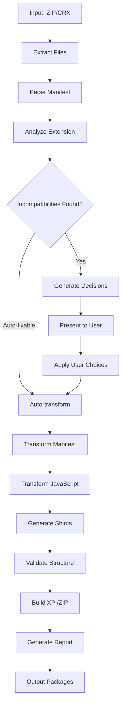

# Chrome-to-Firefox Extension Converter - Architecture

## Overview
A Rust-based tool to convert Chrome MV3 extensions to Firefox-compatible MV3 extensions. The core engine handles manifest transformation, JavaScript code analysis/rewriting, and generates Firefox-compatible packages.

## Project Structure

```
chrome-to-firefox/
├── Cargo.toml
├── src/
│   ├── main.rs                 # CLI entry point
│   ├── lib.rs                  # Library root (for WASM later)
│   ├── models/
│   │   ├── mod.rs
│   │   ├── manifest.rs         # Manifest data structures
│   │   ├── extension.rs        # Extension metadata
│   │   ├── conversion.rs       # Conversion context & results
│   │   └── incompatibility.rs  # Incompatibility tracking
│   ├── parser/
│   │   ├── mod.rs
│   │   ├── manifest.rs         # Manifest parser
│   │   └── javascript.rs       # JS code analyzer
│   ├── analyzer/
│   │   ├── mod.rs
│   │   ├── manifest.rs         # Manifest compatibility checker
│   │   ├── api.rs              # Chrome API usage detection
│   │   └── patterns.rs         # Known incompatibility patterns
│   ├── transformer/
│   │   ├── mod.rs
│   │   ├── manifest.rs         # Manifest transformer
│   │   ├── javascript.rs       # JS code transformer
│   │   └── shims.rs            # Compatibility shim generator
│   ├── decision/
│   │   ├── mod.rs
│   │   └── tree.rs             # Decision tree for user choices
│   ├── packager/
│   │   ├── mod.rs
│   │   ├── extractor.rs        # ZIP/CRX extraction
│   │   └── builder.rs          # XPI/ZIP builder
│   ├── validator/
│   │   ├── mod.rs
│   │   └── structure.rs        # Structural validation
│   └── report/
│       ├── mod.rs
│       └── generator.rs        # Conversion report
├── tests/
│   ├── integration_tests.rs
│   └── fixtures/
│       └── LatexToCalc/        # Test extension
└── docs/
    ├── CONVERSION_RULES.md     # Detailed conversion rules
    └── API_MAPPINGS.md         # Chrome↔Firefox API mappings
```

## Core Data Models

### Extension Metadata
```rust
pub struct Extension {
    pub manifest: Manifest,
    pub files: HashMap<PathBuf, Vec<u8>>,
    pub js_files: Vec<JavaScriptFile>,
    pub metadata: ExtensionMetadata,
}

pub struct ExtensionMetadata {
    pub name: String,
    pub version: String,
    pub manifest_version: u8,
    pub size: usize,
    pub file_count: usize,
}
```

### Manifest Models
```rust
pub struct Manifest {
    pub manifest_version: u8,
    pub name: String,
    pub version: String,
    pub background: Option<Background>,
    pub action: Option<Action>,
    pub permissions: Vec<String>,
    pub host_permissions: Vec<String>,
    pub content_scripts: Vec<ContentScript>,
    pub web_accessible_resources: Vec<WebAccessibleResource>,
    pub content_security_policy: Option<ContentSecurityPolicy>,
    pub browser_specific_settings: Option<BrowserSpecificSettings>,
    // ... other fields
}

pub struct Background {
    pub service_worker: Option<String>,
    pub scripts: Option<Vec<String>>,
}
```

### Conversion Context
```rust
pub struct ConversionContext {
    pub source: Extension,
    pub decisions: Vec<UserDecision>,
    pub incompatibilities: Vec<Incompatibility>,
    pub warnings: Vec<Warning>,
    pub auto_fixes: Vec<AutoFix>,
}

pub struct UserDecision {
    pub decision_id: String,
    pub category: DecisionCategory,
    pub question: String,
    pub options: Vec<DecisionOption>,
    pub selected: Option<usize>,
    pub default: usize,
}

pub enum DecisionCategory {
    BackgroundArchitecture,
    ApiStrategy,
    HostPermissions,
    WebRequest,
    Offscreen,
    Other,
}
```

### Incompatibility Tracking
```rust
pub struct Incompatibility {
    pub severity: Severity,
    pub category: IncompatibilityCategory,
    pub location: Location,
    pub description: String,
    pub suggestion: Option<String>,
    pub auto_fixable: bool,
}

pub enum Severity {
    Blocker,    // Cannot be converted
    Major,      // Requires user decision
    Minor,      // Auto-fixable with warning
    Info,       // Just informational
}

pub enum IncompatibilityCategory {
    ManifestStructure,
    BackgroundWorker,
    ChromeOnlyApi,
    ApiNamespace,
    CallbackVsPromise,
    HostPermissions,
    WebRequest,
    WebAccessibleResources,
    Csp,
}
```

## Conversion Pipeline


```mermaid
graph TD
    A[Input: ZIP/CRX] --> B[Extract Files]
    B --> C[Parse Manifest]
    C --> D[Analyze Extension]
    D --> E{Incompatibilities Found?}
    E -->|Yes| F[Generate Decisions]
    F --> G[Present to User]
    G --> H[Apply User Choices]
    E -->|Auto-fixable| I[Auto-transform]
    H --> I
    I --> J[Transform Manifest]
    J --> K[Transform JavaScript]
    K --> L[Generate Shims]
    L --> M[Validate Structure]
    M --> N[Build XPI/ZIP]
    N --> O[Generate Report]
    O --> P[Output Packages]
```

## Manifest Transformation Rules

### 1. Background Architecture
**Detection:**
- Has `background.service_worker`

**Transformation:**
- Keep `service_worker` for Chrome
- Add `scripts` array with event page implementation
- If service worker uses `importScripts()`, convert to module array

**User Decision Required:**
- If complex service worker with chrome.offscreen usage
- If service worker has long-running timers

### 2. Host Permissions
**Detection:**
- Has entries in `permissions` that are match patterns

**Transformation:**
- Move match patterns from `permissions` to `host_permissions`
- Keep API permissions in `permissions`

**User Decision Required:**
- Strategy for permission UX (Firefox grants on-use vs Chrome grants on-install)

### 3. Browser Specific Settings
**Detection:**
- Missing `browser_specific_settings`

**Transformation:**
- Add `browser_specific_settings.gecko.id`
- Add `browser_specific_settings.gecko.strict_min_version: "121.0"`

**User Decision Required:**
- Extension ID format (email-style vs UUID)

### 4. Content Security Policy
**Detection:**
- Has `content_security_policy` as string (MV2 format)
- Missing `wasm-unsafe-eval` for WASM usage

**Transformation:**
- Convert to object format: `content_security_policy.extension_pages`
- Add `'wasm-unsafe-eval'` if WASM detected

### 5. Web Accessible Resources
**Detection:**
- Has `use_dynamic_url` property

**Transformation:**
- Remove `use_dynamic_url` (not supported in Firefox)
- Ensure `matches` or `extension_ids` are present

### 6. Action API
**Detection:**
- Has `browser_action` (MV2 leftover)

**Transformation:**
- Rename to `action`
- Remove `browser_style` property (not supported in MV3)

## JavaScript Transformation Rules

### 1. API Namespace
**Pattern:** `chrome.apiName`
**Transform:** Add `browser` namespace compatibility

**Strategy:**
```javascript
// Original
chrome.storage.local.get('key', callback);

// Option A: Use polyfill (add to shims)
if (typeof browser === 'undefined') {
  var browser = chrome;
}

// Option B: Direct rewrite
browser.storage.local.get('key').then(callback);
```

### 2. Callback to Promise
**Pattern:** Chrome callback-style APIs
**Transform:** Firefox promise-style

**Detection:**
- Last parameter is a function
- Function checks `chrome.runtime.lastError`

**Transform:**
```javascript
// Before
chrome.storage.local.get('key', (result) => {
  if (chrome.runtime.lastError) {
    console.error(chrome.runtime.lastError);
  } else {
    console.log(result);
  }
});

// After
browser.storage.local.get('key')
  .then((result) => console.log(result))
  .catch((error) => console.error(error));
```

### 3. importScripts in Service Worker
**Detection:** `importScripts()` calls in service worker

**Transform:** Convert to array in `background.scripts`

### 4. chrome.offscreen Detection
**Pattern:** Usage of `chrome.offscreen` API

**User Decision Required:**
- Provide fallback implementation
- Document that manual refactoring needed

### 5. tabs.executeScript (MV2 leftover)
**Detection:** `chrome.tabs.executeScript` or `chrome.tabs.insertCSS`

**Transform:** Convert to `chrome.scripting.executeScript`

```javascript
// Before
chrome.tabs.executeScript(tabId, { code: 'alert(1)' });

// After
chrome.scripting.executeScript({
  target: { tabId: tabId },
  func: () => alert(1)
});
```

## Decision Tree System

### Decision Types

1. **Background Architecture**
   - **Question:** "Your extension uses a service worker. How should we handle Firefox compatibility?"
   - **Options:**
     - Create event page with equivalent functionality (recommended)
     - Keep service worker only (Chrome-only)
     - Manual conversion needed (for complex cases)

2. **WebRequest Strategy**
   - **Question:** "Your extension uses blocking webRequest. Choose conversion strategy:"
   - **Options:**
     - Keep blocking webRequest (Firefox-only feature)
     - Convert to declarativeNetRequest (cross-browser)
     - Support both approaches (recommended)

3. **Host Permissions UX**
   - **Question:** "Firefox treats host_permissions as optional. How should your extension handle this?"
   - **Options:**
     - Add permission request flow in extension
     - Document for users to grant manually
     - No changes (rely on Firefox defaults)

4. **Extension ID Format**
   - **Question:** "Choose Firefox extension ID format:"
   - **Options:**
     - Email-style: `extension@yourdomain.com` (recommended)
     - UUID format: `{12345678-1234-1234-1234-123456789012}`
     - Generate automatically

5. **Offscreen Document Usage**
   - **Question:** "Your extension uses chrome.offscreen (Chrome-only). Choose approach:"
   - **Options:**
     - Remove feature (breaking)
     - Use event page workaround (needs manual code)
     - Keep Chrome-only (document limitation)

## Compatibility Shims

### browser Namespace Polyfill
```javascript
// shims/browser-polyfill.js
if (typeof browser === 'undefined') {
  window.browser = window.chrome;
}
```

### Promise Wrapper for Callbacks
```javascript
// shims/promise-wrapper.js
function promisify(fn) {
  return function(...args) {
    return new Promise((resolve, reject) => {
      fn(...args, (result) => {
        if (chrome.runtime.lastError) {
          reject(chrome.runtime.lastError);
        } else {
          resolve(result);
        }
      });
    });
  };
}
```

### Cross-browser Action API
```javascript
// shims/action-compat.js
const browserAction = chrome.action || chrome.browserAction;
```

## Validation Rules

### Structural Validation
1. ✓ Manifest is valid JSON
2. ✓ Required fields present (name, version, manifest_version)
3. ✓ Referenced files exist
4. ✓ Icons exist at specified paths
5. ✓ Content scripts reference valid files
6. ✓ Background scripts exist
7. ✓ No conflicting permissions

### Firefox-Specific Validation
1. ✓ `browser_specific_settings.gecko.id` present
2. ✓ Version format is numeric only
3. ✓ `web_accessible_resources` has valid structure
4. ✓ No `use_dynamic_url` in web_accessible_resources
5. ✓ CSP is in MV3 object format
6. ✓ No `browser_style` in MV3

### API Usage Validation
1. ⚠ Warn on Chrome-only APIs
2. ⚠ Warn on experimental APIs
3. ⚠ Check namespace usage (chrome vs browser)
4. ℹ Info on deprecated APIs

## Conversion Report Format

```markdown
# Extension Conversion Report

## Summary
- Extension: [Name] v[Version]
- Conversion Date: [ISO 8601]
- Success: [Yes/No]
- Warnings: [Count]
- Manual Actions Required: [Count]

## Manifest Changes
### Automatic Changes
- ✓ Added background.scripts for Firefox
- ✓ Moved host_permissions
- ✓ Added browser_specific_settings

### User Decisions Applied
- Background architecture: Event page
- WebRequest: Keep blocking
- Extension ID: extension@domain.com

## JavaScript Transformations
### Files Modified
- background.js: 15 changes
  - ✓ Converted chrome → browser (8)
  - ✓ Converted callbacks → promises (5)
  - ⚠ Manual check needed: offscreen API (2)

## Compatibility Issues
### Blockers (0)
None

### Manual Actions Required (1)
1. **Offscreen Document Usage** (background.js:123)
   - Chrome's offscreen API is not available in Firefox
   - Suggestion: Refactor to use event page or visible popup

### Warnings (3)
1. **Host Permissions UX** (manifest.json)
   - Firefox prompts users for host permissions
   - Suggestion: Add permission request flow in your extension

## Files Generated
- firefox_extension.xpi (Firefox package)
- chrome_extension_modified.zip (Modified source)
- conversion_report.md (This file)

## Next Steps
1. Test the extension in Firefox
2. Address manual action items
3. Submit to AMO if ready
```

## Implementation Strategy

### Phase 1: Core Infrastructure (Current Focus)
1. Set up Rust project with dependencies
2. Implement manifest parser and data models
3. Create basic analyzer for incompatibilities
4. Build manifest transformer
5. Implement file operations (ZIP handling)

### Phase 2: JavaScript Analysis
1. Add JavaScript AST parsing (using swc or tree-sitter)
2. Implement Chrome API detection
3. Build pattern matching for common issues
4. Create transformation rules

### Phase 3: Decision System
1. Implement decision tree logic
2. Add CLI prompts for user decisions
3. Create decision presets for common scenarios

### Phase 4: Generation & Validation
1. Build package generators (XPI/ZIP)
2. Implement validation system
3. Create report generator

### Phase 5: Testing & Refinement
1. Test with LatexToCalc
2. Test with other real extensions
3. Refine transformation rules
4. Add more compatibility shims

### Phase 6: WASM Preparation
1. Modularize for WASM compilation
2. Create clean public API
3. Add serialization for web interface

## Dependencies

```toml
[dependencies]
serde = { version = "1.0", features = ["derive"] }
serde_json = "1.0"
regex = "1.10"
zip = "0.6"
anyhow = "1.0"
thiserror = "1.0"
walkdir = "2.4"
clap = { version = "4.4", features = ["derive"] }
dialoguer = "0.11"  # For CLI prompts
colored = "2.1"     # For colored output

# JavaScript parsing (choose one):
# Option 1: swc (full JS parser, heavier)
swc_ecma_parser = "0.147"
swc_common = "0.34"
swc_ecma_ast = "0.113"

# Option 2: tree-sitter (lighter, pattern matching)
tree-sitter = "0.20"
tree-sitter-javascript = "0.20"

[dev-dependencies]
tempfile = "3.8"
pretty_assertions = "1.4"
```

## Key Algorithms

### 1. Manifest Transformation Algorithm
```
1. Parse manifest.json
2. Detect manifest_version
3. If MV3:
   a. Analyze background configuration
   b. Check permissions structure
   c. Validate web_accessible_resources
   d. Check CSP format
4. Generate incompatibility list
5. Present decisions to user
6. Apply transformations:
   - Add Firefox-specific fields
   - Restructure incompatible sections
   - Add shim references if needed
7. Validate result
8. Return transformed manifest
```

### 2. JavaScript Analysis Algorithm
```
1. For each .js file:
   a. Parse to AST
   b. Walk AST looking for:
      - chrome.* API calls
      - Callback patterns
      - Runtime.lastError checks
      - importScripts calls
      - Specific Chrome-only APIs
   c. Record locations and patterns
2. Categorize findings:
   - Auto-fixable: namespace, simple callbacks
   - Needs decision: webRequest, offscreen
   - Info only: experimental APIs
3. Generate transformation plan
4. Apply selected transformations
5. Insert shim imports if needed
6. Validate transformed code
```

### 3. Decision Resolution Algorithm
```
1. Collect all incompatibilities
2. Group by category
3. For each category:
   a. Check if auto-fixable
   b. If not, generate decision
   c. Include context (file, line, code)
   d. Provide options with defaults
4. Sort decisions by priority:
   - Blockers first
   - Major issues
   - Optional improvements
5. Present decisions sequentially
6. Validate decision combinations
7. Apply all decisions atomically
```

## Testing Strategy

### Unit Tests
- Manifest parsing edge cases
- Individual transformation rules
- Decision logic
- Validation rules

### Integration Tests
- Full conversion pipeline with fixtures
- LatexToCalc conversion
- Various manifest structures
- Different MV3 patterns

### Test Fixtures
1. Simple extension (minimal MV3)
2. LatexToCalc (real-world complexity)
3. Service worker heavy extension
4. Content script heavy extension
5. Permission-intensive extension
6. WebRequest extension

## Future Enhancements

1. **Batch Processing**: Convert multiple extensions
2. **Diff View**: Visual diff of changes
3. **Rollback**: Undo transformations
4. **Custom Rules**: User-defined transformation rules
5. **API Database**: Complete Chrome/Firefox API mapping
6. **Statistical Analysis**: Success rate tracking
7. **Auto-update**: Keep conversion rules current
8. **Plugin System**: Extensible transformation engine