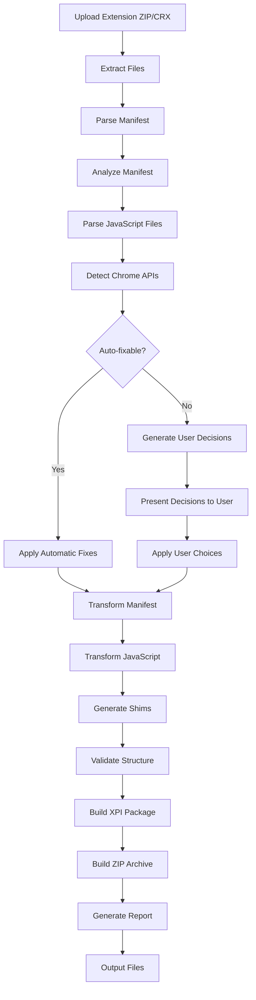

# Chrome-to-Firefox Extension Converter - Project Summary

## Overview

This project provides a Rust-based tool to automatically convert Chrome Manifest V3 extensions to Firefox-compatible MV3 extensions. The converter analyzes extension structure, identifies incompatibilities, applies automatic transformations where possible, and prompts users for decisions on ambiguous cases.

## Key Features

### ✅ Automatic Conversions
- **Manifest Structure**: Adds `browser_specific_settings`, transforms background configuration, moves host permissions
- **Namespace**: Adds compatibility shims for `chrome.*` ↔ `browser.*`
- **CSP Format**: Converts MV2 string format to MV3 object format
- **Web Accessible Resources**: Removes Firefox-unsupported `use_dynamic_url`
- **Action API**: Renames `browser_action` to `action`, removes `browser_style`

### 🤔 User Decisions Required
- **Background Architecture**: Service worker → Event page conversion strategy
- **WebRequest**: Keep blocking (Firefox-only) vs convert to DNR (cross-browser)
- **Extension ID**: Choose format for Firefox submission
- **Offscreen API**: Chrome-only feature requiring alternative approach
- **Host Permissions**: UX strategy for Firefox's optional permission model

### 📊 Output Formats
- **Firefox Package**: `.xpi` file ready for Firefox/AMO
- **Source Archive**: `.zip` with modified source files
- **Conversion Report**: Detailed markdown report of all changes
- **Diff View**: Shows exact changes made to each file

## Project Structure

```
chrome-to-firefox/
├── ARCHITECTURE.md           # Detailed architecture documentation
├── API_MAPPINGS.md           # Chrome ↔ Firefox API mappings
├── IMPLEMENTATION_GUIDE.md   # Step-by-step implementation specs
├── PROJECT_SUMMARY.md        # This file
├── Cargo.toml                # Rust dependencies
├── src/
│   ├── main.rs              # CLI entry point
│   ├── lib.rs               # Library root (WASM-ready)
│   ├── models/              # Data structures
│   ├── parser/              # Manifest & JS parsing
│   ├── analyzer/            # Incompatibility detection
│   ├── transformer/         # Code transformation
│   ├── decision/            # User decision system
│   ├── packager/            # ZIP/XPI creation
│   ├── validator/           # Structural validation
│   └── report/              # Report generation
└── tests/
    └── fixtures/
        └── LatexToCalc/     # Test extension
```

## Technology Stack

### Core Technologies
- **Rust**: Core implementation language
- **serde/serde_json**: JSON parsing for manifest files
- **zip**: Archive extraction and creation
- **swc**: JavaScript parsing and AST manipulation
- **regex**: Pattern matching for API detection
- **clap**: CLI interface
- **dialoguer**: Interactive prompts

### Future: WASM Integration
- **wasm-bindgen**: Rust ↔ JavaScript bridge
- **web-sys**: Web APIs access
- Frontend: HTML/CSS/JavaScript for web interface

## Conversion Pipeline



## Key Incompatibilities Handled

### 1. Background Context
**Issue**: Chrome uses service workers, Firefox uses event pages
**Solution**: Keep both keys in manifest; service worker for Chrome, scripts array for Firefox

### 2. Host Permissions
**Issue**: Firefox treats host_permissions as optional (user can deny)
**Solution**: Move match patterns to host_permissions, warn user to implement permission request flow

### 3. WebRequest API
**Issue**: Chrome removed blocking webRequest, Firefox still supports it
**Solution**: User decides: keep blocking (Firefox-only) or convert to DNR (cross-browser)

### 4. Offscreen Documents
**Issue**: Chrome-only API for DOM work from service worker
**Solution**: Flag as requiring manual refactoring; suggest event page or visible popup

### 5. API Namespace
**Issue**: Chrome uses `chrome.*`, Firefox prefers `browser.*`
**Solution**: Add polyfill shim making both namespaces work

### 6. Promises vs Callbacks
**Issue**: Firefox uses promises, Chrome historically used callbacks (MV3 adds promise support)
**Solution**: Optional transformation to promise-based code with cross-browser compatibility

## Example: LatexToCalc Conversion

### Input (Chrome)
```json
{
  "manifest_version": 3,
  "name": "LatexToCalc",
  "version": "2.0.1",
  "background": {
    "service_worker": "background.js"
  },
  "permissions": [
    "clipboardRead",
    "clipboardWrite",
    "activeTab",
    "scripting"
  ],
  "host_permissions": [
    "https://*/*"
  ]
}
```

### Output (Firefox-compatible)
```json
{
  "manifest_version": 3,
  "name": "LatexToCalc",
  "version": "2.0.1",
  "background": {
    "service_worker": "background.js",
    "scripts": ["background.js"]
  },
  "permissions": [
    "clipboardRead",
    "clipboardWrite",
    "activeTab",
    "scripting"
  ],
  "host_permissions": [
    "https://*/*"
  ],
  "browser_specific_settings": {
    "gecko": {
      "id": "latextocalc@yourdomain.com",
      "strict_min_version": "121.0"
    }
  }
}
```

### JavaScript Transformation Example

**Before (Chrome-style):**
```javascript
chrome.storage.local.get('key', (result) => {
  if (chrome.runtime.lastError) {
    console.error(chrome.runtime.lastError);
  } else {
    console.log(result);
  }
});
```

**After (Cross-browser):**
```javascript
// With browser polyfill shim
browser.storage.local.get('key')
  .then(result => console.log(result))
  .catch(error => console.error(error));
```

## Implementation Phases

### Phase 1: Core Infrastructure ✅ (Designed)
- [x] Project structure defined
- [x] Data models specified
- [x] Architecture documented
- [x] API mappings compiled

### Phase 2: Parser & Analyzer (Next)
- [ ] Manifest parser implementation
- [ ] JavaScript AST parser
- [ ] Incompatibility detection
- [ ] Pattern matching rules

### Phase 3: Transformation Engine
- [ ] Manifest transformer
- [ ] JavaScript code rewriter
- [ ] Shim generator
- [ ] File operations

### Phase 4: User Interaction
- [ ] Decision tree system
- [ ] CLI prompts
- [ ] Validation feedback
- [ ] Report generation

### Phase 5: Packaging & Output
- [ ] ZIP/CRX extraction
- [ ] XPI/ZIP creation
- [ ] Report formatting
- [ ] Error handling

### Phase 6: Testing & Refinement
- [ ] Unit tests
- [ ] Integration tests with LatexToCalc
- [ ] Additional extension testing
- [ ] Documentation completion

### Phase 7: WASM & Web Interface
- [ ] WASM compilation
- [ ] Web frontend
- [ ] File upload system
- [ ] Browser-based conversion

## Success Metrics

### Primary Goals
1. **Accuracy**: 95%+ of automatic conversions are correct
2. **Coverage**: Handle 90%+ of common MV3 patterns
3. **Usability**: Clear decisions with good defaults
4. **Speed**: Convert typical extension in <5 seconds

### Quality Indicators
- All tests pass with LatexToCalc
- Converted extensions load in Firefox without errors
- Generated reports are clear and actionable
- Decision prompts are understandable to non-experts

## Example Usage

### CLI Interface
```bash
# Convert an extension
chrome-to-firefox convert --input extension.zip --output ./firefox-extension

# Analyze without converting
chrome-to-firefox analyze --input extension.zip

# Auto-accept defaults (non-interactive)
chrome-to-firefox convert --input extension.zip --output ./output --yes

# Generate detailed report
chrome-to-firefox convert --input extension.zip --output ./output --report
```

### Sample Output
```
Chrome to Firefox Extension Converter
======================================

📦 Loading extension: extension.zip
✓ Extracted 47 files (1.2 MB)

📋 Analyzing manifest...
✓ Found 3 auto-fixable issues
⚠ Found 2 issues requiring decisions

🔧 Auto-fixes applied:
  ✓ Added browser_specific_settings.gecko.id
  ✓ Added background.scripts for Firefox
  ✓ Removed web_accessible_resources.use_dynamic_url

❓ Decision required: Background Architecture
   Your extension uses a service worker. How should we handle Firefox?
   
   1. Create event page (recommended)
   2. Keep service worker only (Chrome-only)
   3. Manual conversion needed
   
   Choice [1]: 1

✓ Applied all transformations
✓ Generated Firefox package: firefox-extension.xpi
✓ Generated source archive: firefox-extension-source.zip
✓ Generated conversion report: conversion-report.md

Summary:
  - 5 files modified
  - 1 file added (browser-polyfill.js)
  - 0 blockers
  - 1 warning (implement permission request flow)

🎉 Conversion complete!
```

## Documentation Structure

### For Developers
- **ARCHITECTURE.md**: System design, algorithms, data flow
- **IMPLEMENTATION_GUIDE.md**: Code specifications, examples
- **API_MAPPINGS.md**: Chrome ↔ Firefox API differences

### For Users
- **README.md**: Quick start, installation, basic usage
- **CONVERSION_RULES.md**: What gets converted and how
- **FAQ.md**: Common questions and troubleshooting

## Next Steps

The architecture and planning phase is complete. The project is now ready for implementation:

1. **Switch to Code Mode**: Begin implementing the Rust codebase
2. **Start with Core Models**: Implement data structures from IMPLEMENTATION_GUIDE.md
3. **Build Parser**: Create manifest and JavaScript parsers
4. **Implement Analyzer**: Detect incompatibilities
5. **Create Transformer**: Apply conversions
6. **Add CLI**: Build user interface
7. **Test**: Validate with LatexToCalc
8. **Iterate**: Refine based on test results

## Questions for User

Before proceeding to implementation, please confirm:

1. ✅ Is the overall architecture acceptable?
2. ✅ Are the conversion strategies aligned with your vision?
3. ✅ Is the decision system appropriate for user interaction?
4. ✅ Are there any additional features you'd like included?
5. ✅ Should we prioritize any particular aspect?

Ready to switch to **Code Mode** and start implementation?